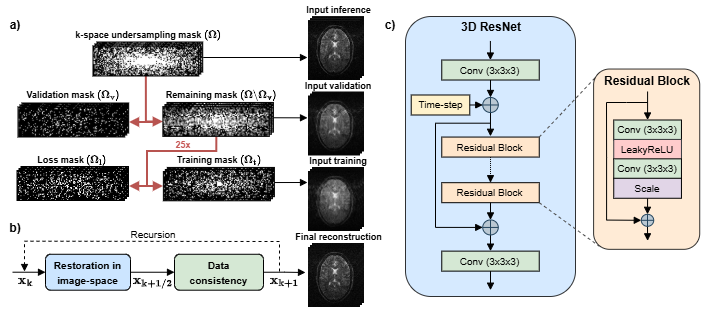
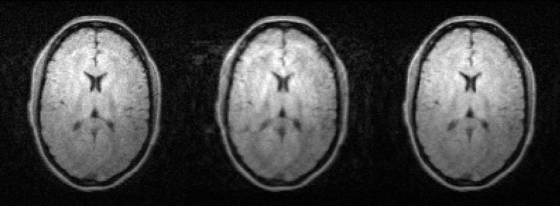

# ULF-ZS-SSL
This repository provides a PyTorch implementation for training and deploying time-conditioned 3D zero-shot self-supervised learning for ultra-low-field MRI reconstruction (ULF-ZS-SSL). For the original ZS-SSL implementation in PyTorch, please visit ([here](https://github.com/byaman14/ZS-SSL-PyTorch)).

 <br>

*Overview of the ultra-low-field zero-shot self-supervised learning reconstruction framework (ULF-ZS-SSL). a) The acquired undersampled k-space (Ω) is randomly partitioned into three non-overlapping subsets: a training mask (Ωt) used for data-consistency (DC) enforcement, a loss mask (Ωl) used to compute the self-supervised loss, and a validation mask (Ωv) used for early stopping. The training and loss partitioning is randomly re-sampled 25 times to improve generalization. b) Reconstruction is performed through an unrolled optimization that alternates between image-domain restoration and physics-based DC solved by conjugate-gradient in 10 iterations. c) The restoration module is implemented as a time-conditioned 3D ResNet consisting of residual blocks with 3×3×3 convolutions, LeakyReLU activation, and a scaling factor (0.1). The sinusoidal time-step embedding encodes the iteration index to guide progressive denoising across unrolled steps.*

## Installation
First clone this repository using git.
```bash
git clone https://github.com/MartvStraten/ULF_3D_ZS_SSL.git
cd ULF_3D_ZS_SSL
```
It is recommended to create a new conda environment before installing the required libraries. Python version 3.12.7 was used.
```bash
conda create -n ulf_zs_ssl python=3.12.7
conda activate ulf_zs_ssl
```
The dependencies can be installed using pip install. When using a GPU, always make sure to match your PyTorch version to your CUDA version.
```bash
pip install -r requirements.txt
```
For extra implementation details or a different installation guide, we recommend to visit the original ZS-SSL Github repository ([here](https://github.com/byaman14/ZS-SSL-PyTorch)).

## Datasets
Three fully-sampled ultra-low-field datasets with IR-T1w, T1w, and T2w contrasts are available in this repository.

## Hardware requirements
The current implementation of the code supports training on a GPU. The amount of GPU memory used is dependent on the number of unrolls and ResNet blocks you use. In the current implementation with 5 unrolled iterations and 5 ResNet blocks, it is recommended to use a GPU with 24+ GB of memory. Inference can be run on CPU as well but will be slower.

## Expected results
After training the model using `ulf_3d_zs_ssl_recon.ipynb` and running the inference using `ulf_3d_zs_ssl_inference.ipynb`, the following output can be expected. From left to right: the fully-sampled input image, the retrospectively undersampled zero-filled model input, and the ULF-ZS-SSL model output.

 <br>